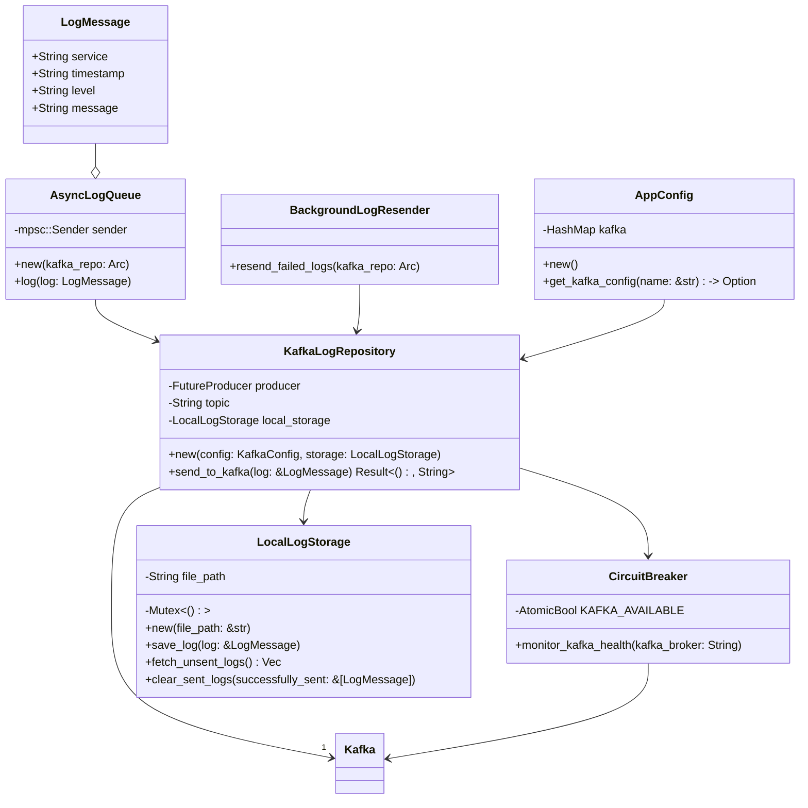
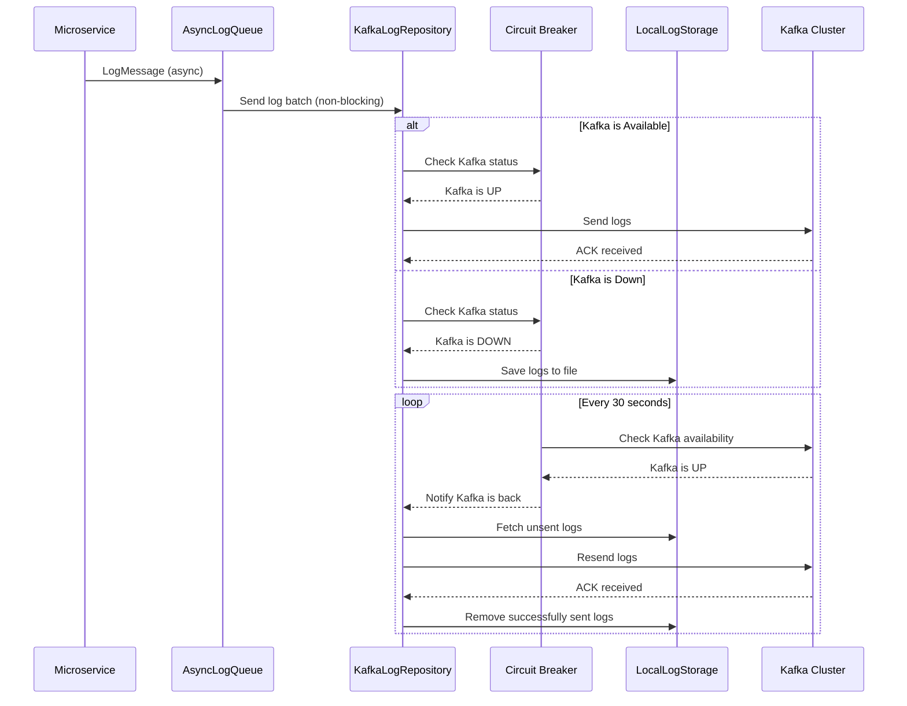

# logappender-rs
LogAppender is project prove of concept for log shipper asynchronusly from one source to multiple destinations. This project is written in Rust.

```mermaid
classDiagram
    class LogMessage {
        +String service
        +String timestamp
        +String level
        +String message
    }

    class AsyncLogQueue {
        -mpsc::Sender<LogMessage> sender
        +new(kafka_repo: Arc<KafkaLogRepository>)
        +log(log: LogMessage)
    }

    class KafkaLogRepository {
        -FutureProducer producer
        -String topic
        -LocalLogStorage local_storage
        +new(config: KafkaConfig, storage: LocalLogStorage)
        +send_to_kafka(log: &LogMessage) Result<(), String>
    }

    class CircuitBreaker {
        -AtomicBool KAFKA_AVAILABLE
        +monitor_kafka_health(kafka_broker: String)
    }

    class LocalLogStorage {
        -Mutex<()>
        -String file_path
        +new(file_path: &str)
        +save_log(log: &LogMessage)
        +fetch_unsent_logs() Vec<LogMessage>
        +clear_sent_logs(successfully_sent: &[LogMessage])
    }

    class BackgroundLogResender {
        +resend_failed_logs(kafka_repo: Arc<KafkaLogRepository>)
    }

    class AppConfig {
        -HashMap<String, KafkaConfig> kafka
        +new()
        +get_kafka_config(name: &str) -> Option<KafkaConfig>
    }

    LogMessage --o AsyncLogQueue
    AsyncLogQueue --> KafkaLogRepository
    KafkaLogRepository --> CircuitBreaker
    KafkaLogRepository --> LocalLogStorage
    KafkaLogRepository --> "1" Kafka
    CircuitBreaker --> Kafka
    BackgroundLogResender --> KafkaLogRepository
    AppConfig --> KafkaLogRepository
```

```mermaid
sequenceDiagram
    participant Service as Microservice
    participant LogQueue as AsyncLogQueue
    participant KafkaRepo as KafkaLogRepository
    participant CircuitBreaker as Circuit Breaker
    participant LocalStorage as LocalLogStorage
    participant Kafka as Kafka Cluster

    Service->>LogQueue: LogMessage (async)
    LogQueue->>KafkaRepo: Send log batch (non-blocking)

    alt Kafka is Available
        KafkaRepo->>CircuitBreaker: Check Kafka status
        CircuitBreaker-->>KafkaRepo: Kafka is UP
        KafkaRepo->>Kafka: Send logs
        Kafka-->>KafkaRepo: ACK received
    else Kafka is Down
        KafkaRepo->>CircuitBreaker: Check Kafka status
        CircuitBreaker-->>KafkaRepo: Kafka is DOWN
        KafkaRepo->>LocalStorage: Save logs to file
    end

    loop Every 30 seconds
        CircuitBreaker->>Kafka: Check Kafka availability
        Kafka-->>CircuitBreaker: Kafka is UP
        CircuitBreaker-->>KafkaRepo: Notify Kafka is back
        KafkaRepo->>LocalStorage: Fetch unsent logs
        KafkaRepo->>Kafka: Resend logs
        Kafka-->>KafkaRepo: ACK received
        KafkaRepo->>LocalStorage: Remove successfully sent logs
    end
```